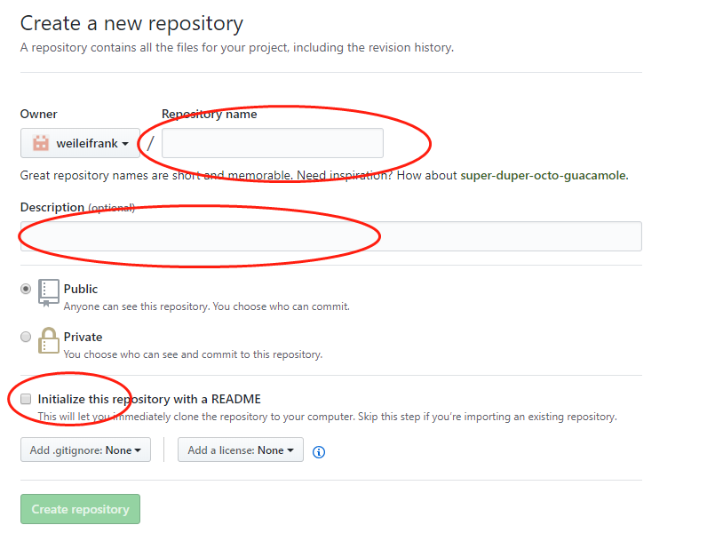

### 安装git(Windows平台)

- git下载地址 https://git-scm.com/downloads
- 右键Git  Bash通过git命令查看是否成功
- 右键Git  Bash通过git version查看版本
```$xslt
 git version 
 
 git version 2.19.2.windows.1
```
### 自我介绍给git
每次 Git 提交时都会引用这两条信息，说明是谁提交了更新

```
git config --global user.name "frank
git config --global user.email "1138289316@qq.com"
```

| **   | 如果您希望能够为不同的项目使用不同的用户名和电子邮件，请在没有*--global*选项的情况下从项目目录运行上述命令。 |
| ---- | ------------------------------------------------------------ |
|      |                                                              |

- 查看用户信息`git config --list`
```$xslt
$ git config --list
core.symlinks=false
core.autocrlf=true
core.fscache=true
color.diff=auto
color.status=auto
color.branch=auto
color.interactive=true
help.format=html
rebase.autosquash=true
http.sslcainfo=C:/Program Files/Git/mingw64/ssl/certs/ca-bundle.crt
http.sslbackend=openssl
diff.astextplain.textconv=astextplain
filter.lfs.clean=git-lfs clean -- %f
filter.lfs.smudge=git-lfs smudge -- %f
filter.lfs.process=git-lfs filter-process
filter.lfs.required=true
credential.helper=manager
user.email=1138289316@qq.com                     
user.name=frank
core.repositoryformatversion=0
core.filemode=false
core.bare=false
core.logallrefupdates=true
core.symlinks=false
core.ignorecase=true

```
### 创建版本库repository

版本库:可以简单理解成一个目录,这个目录里的所有文件都可以被git管理起来,每个文件的修改、删除，Git都能跟踪，以便任何时刻都可以追踪历史，或者在将来某个时刻可以“还原”。

- 首先创建一个项目的目录

- 目录下执行git init

```$xslt
$ git init
 Initialized empty Git repository in D:/GoProjects/src/gitdemo/.git/
```
 
  通过`git init`命令把这个目录变成Git可以管理的仓库：

  目录下多了一个`.git`的目录，这个目录是Git来跟踪管理版本库的

  如果没有看到`.git`目录，因为这个目录默认是隐藏的，用`ls -ah`命令即可看见
### 忽略文件

编译的中间文件不需要上传到git,就可以通过忽略文件来实现

- 工程目录下执行`vi .gitignore`生成忽略文件

- 在文件中定义忽略的内容,写法如下

  https://github.com/github/gitignore

- 忽略的标准

1. 忽略操作系统自动生成的文件，比如缩略图等；
2. 忽略编译生成的中间文件、可执行文件等，也就是如果一个文件是通过另一个文件自动生成的，那自动生成的文件就没必要放进版本库；
3. 忽略你自己的带有敏感信息的配置文件，比如存放口令的配置文件

### 状态命令

- git  status

  查看自从我上次向Git存储库提交更改以来修改了哪些文件

  

  红色的文件是未跟踪的文件

注意:

> 版本控制系统只能跟踪文本文件的改动
>
> 二进制文件没法跟踪文件的变化(只知道改变了大小,不知道具体改了什么)

### 添加命令(文件内容到索引)添加到购物车

- 使用`git add`

  ```
  $ git add main.go
  ```

  ​

- 一次添加多个`git add --all` 或者`git add .`

  ```
  $ git add --all
  ```


添加完之后,可以再次执行`git status`命令查看状态


### 提交命令(购物车统一结账)

- `git commit -m 'master-第一次初始化代码`

  注:`-m`后面的是这一次的提交说明

  

### 提交记录查看

- `git log`查看完整提交记录

  

- `git log -n`查看最近n次提交记录

  

  注:commit后面的一串字符是`commit id`版本号,SHA1计算 ​
  
  ### 版本回退
  
  - 当前版本往上回退版本`git reset --hard HEAD^`
  
  
  - 往上回退n个版本`git reset --hard HEAD~n`
  
  
  - 回退到某一个版本:`git reset  --hard commit id`
  
  
  - 如果回退之后后悔,想恢复到最新版本
  
    - 通过`git reflog`查看每一次记录
    - 回退到指定的`commit id`
  
  
## 创建与删除分支

- 查看当前分支`git branch`

  ```
  $ git branch
  * master
  ```

- 创建并切换分支`git checkout -b dev `

  ```
  $ git checkout -b dev
  Switched to a new branch 'dev'
  ```

  这个相当于两个命令

  `git branch dev`创建dev分支

  `git checkout dev`切换到dev分支

- 删除分支`git branch -d dev`

  ```
  $ git branch -d dev
  Deleted branch dev (was 80b3178).
  ```
### 合并分支

把dev开发的代码合并到master主分支上

- master主分支执行`git merge dev`

  dev分支增加了person.go

  

  没有冲突是Fast-forward快进模式
  ​
  ### 解决冲突
  
  首先dev分支提交了对main.go的修改,修改内容如下
  
  ```
  func main() {
  	fmt.Println("hello git")
  	str:="这是dev分支的字符串"
  	fmt.Printf("%s\n",str)
  }
  ```
  
  并把修改commit  
  
  master分支开发中也对main.go进行了修改,修改如下
  
  ```
  func main() {
  	fmt.Println("hello git")
  	str:="这是master分支的字符串"
  	fmt.Printf("%s\n",str)
  }
  ```
  
  想要把dev分支合并到主分支master,就会出问题
  
  
  
  这里就会有冲突 
  
  代码中也会出现提示
  
  
  
  HEAD代表当前分支版本,dev代表dev分支
  解决方案就是修改冲突并再次提交
  
  
  
### 远程仓库github

[GitHub](https://github.com/)是一个基于Web的Git仓库托管服务，在这里您可以免费创建一个共享的代码仓库。希望在GitHub上创建私有存储库的人或组织可以购买付费帐户。

http/ssh

- 第1步：创建SSH Key。

  在用户主目录下，看看有没有.ssh目录，如果有，再看看这个目录下有没有`id_rsa`和`id_rsa.pub`这两个文件。如果没有,执行下面命令，创建SSH Key：

  ```
  $ ssh-keygen -t rsa -C "1138289316@qq.com" 
  ```

  建议使用真实的邮箱地址

  `id_rsa`是私钥，`id_rsa.pub`是公钥

- 第2步：登陆GitHub，打开“settings”，“SSH Keys”页面：

  然后，点“New SSH Key”，填上任意Title，在Key文本框里粘贴`id_rsa.pub`文件的内容：


### 创建远程仓库

- 首先，登陆GitHub，在右上角找到“newrepository”按钮，创建一个新的仓库

  

- 在Repository name填入`gitGuide`仓库名，其他保持默认设置



### 添加远程仓库

目前`gitGuide`仓库还是空的，我们可以从这个仓库克隆出新的仓库，也可以把本地仓库与之关联，然后把本地仓库的内容推送到GitHub仓库。

- 本地仓库关联远程仓库  `git remote add origin SSH`

  ```
  $ git remote add origin git@github.com:weileifrank/gitGuide.git
  ```


### 推送到远程仓库

- 推送到远程仓库`git push -u origin 分支`

  ```
  $ git push -u origin master
  ```

  把当前分支`master`推送到远程`master`分支。`-u`会把本地`master`分支和远程`master`分支关联起来

  下一次再提交的话就可以简便

  ```
  $ git push origin master
  ```
  
  如果要推送其他分支，比如`dev`，就改成：
  
  ```
  $ git push origin dev
  
  ```
  
